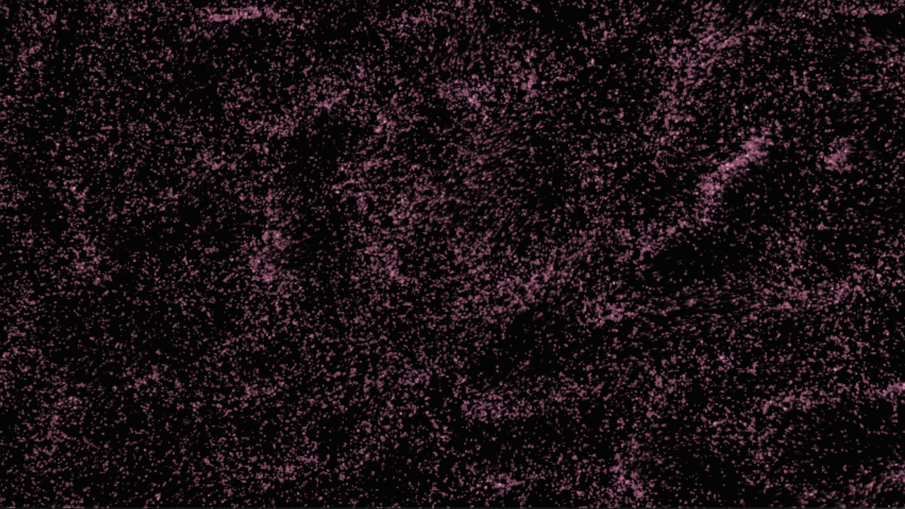
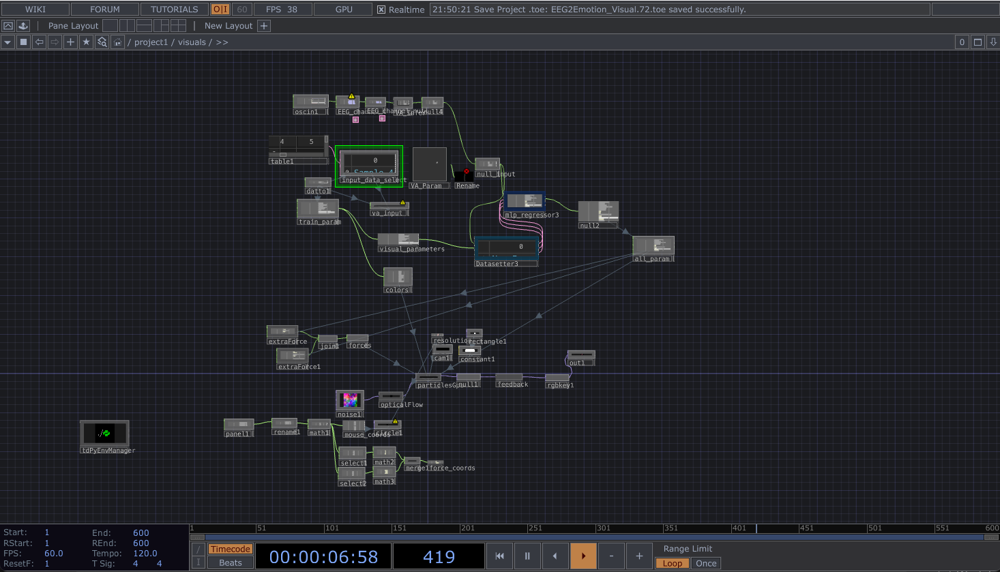
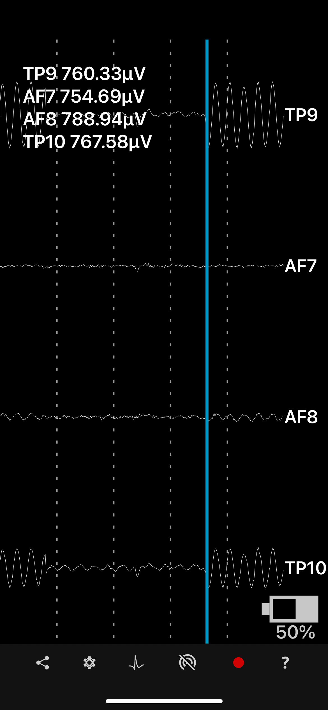

# NeuroCanvas

NeuroCanvas is a real-time EEG-driven generative art system that transforms brainwave activity into visual expression.

The system receives live EEG from a Muse 2 headset, extracts signal features related to frequency activity and hemispheric asymmetry, estimates emotional state as **valence** and **arousal**, and uses those values to control generative visuals in TouchDesigner.

Rather than treating EEG as a direct emotion-reading tool, NeuroCanvas uses brainwave patterns as an expressive input for responsive digital artwork.





## Overview

```text
Muse 2 EEG Headset
  -> Mind Monitor (OSC, WiFi)
  -> EEG Feature Extraction          (61-dim vector / window)
  -> Valence–Arousal Prediction      (LightGBM, 16 s windows)
  -> TouchDesigner
       -> MLP mapping  (V/A -> visual parameters)
       -> Real-Time Generative Visuals
```

The project has **two steps you can run independently**:

1. **V/A prediction** — turn 4-channel Muse EEG (`TP9, AF7, AF8, TP10`) into two continuous values, valence and arousal (each 0–1).
2. **Generative art** — feed V/A into an MLP inside TouchDesigner that drives the visual synthesizer.

## Demo
<p align="center">
  
</p>
---

## Requirements

**Hardware**
- Muse 2 EEG headset
- A phone running [Mind Monitor](https://mind-monitor.com/) (streams Muse EEG over OSC)

<p align="center">
  
</p>

- A computer on the **same WiFi** as the phone

**Software**
- Python 3.10+ (for training / OSC scripts)
- [TouchDesigner](https://derivative.ca/) (for real-time inference and visuals)
- Python packages from `requirements.txt`

> **Two Python environments.** Training and the OSC scripts run in a normal Python
> environment (`pip install -r requirements.txt`). The TouchDesigner half runs in
> TD's own `td-ml` Python environment — the same packages, **minus `pyEDFlib`**, which
> is only needed to read the raw NeuroSense dataset. The runtime feature extraction
> (`touchdesigner/va_features.py`) is dependency-light (NumPy/SciPy only) on purpose.

---

## Setup

```bash
git clone https://github.com/Rayta0320/NeuroCanvas.git
cd NeuroCanvas

python -m venv .venv
source .venv/bin/activate        # Windows: .venv\Scripts\activate
pip install -r requirements.txt
```

For TouchDesigner, point TD's Python at the `td-ml` environment (via TDPyEnvManager)
so it can `import lightgbm, scipy, joblib, sklearn`. See
[`va_prediction_model/touchdesigner/README_TD.md`](va_prediction_model/touchdesigner/README_TD.md).

---

## Data & licensing

The trained model in this repo was built on the **NeuroSense** EEG dataset. The dataset
itself is **not redistributed here** — its Data Use Agreement prohibits sharing the raw
EEG and its derivatives.

- To **retrain from scratch**, request NeuroSense at
  <https://zenodo.org/records/14003181> and unzip it into
  `va_prediction_model/BIDS/` (BIDS layout, Muse 4-channel `.edf`).
- The repo ships a pre-trained `va_window_model.joblib` so the TouchDesigner demo runs
  out of the box. If you prefer to publish only the recipe, delete that file and keep
  the `.gitignore` line that excludes it.
- DEAP / DREAMER folders are **not used** by the current pipeline and are git-ignored.

---

## Usage

### Part 1 — Train the Valence/Arousal model (optional; a trained model is included)

Reads NeuroSense BIDS EEG, extracts 16-second / 61-dim windows, trains a LightGBM
regressor, and saves `va_window_model.joblib`.

```bash
python va_prediction_model/train_window.py
# -> va_prediction_model/preprocessed_data_neurosense/va_window_model.joblib
```

Model summary:
- 16-second EEG windows, 2-second step
- 61 EEG features per window
- Per-subject normalization during training
- LightGBM regression for valence and arousal

### Part 2 — Real-time inference in TouchDesigner

The model is loaded **inside TouchDesigner** (no OSC round-trip) and emits two CHOP
channels, `valence` and `arousal` (each 0–1), at 60 fps.

```text
Muse 2 (Mind Monitor, OSC /muse/eeg @256Hz) → [oscin1] → [rename1] → [VA_Infer] → [null_va] → visuals
```

1. In Mind Monitor, set the **Target IP** to your computer, **Port 5005**, and enable
   **Raw EEG (`/muse/eeg`)** streaming.
2. Open `EEG2Emotion_Visual.toe`.
3. Confirm `oscin1` (OSC In CHOP, Port 5005, *Time Slice = On*) receives 4 channels, and
   `rename1` maps them to `TP9 AF7 AF8 TP10` (this order is required).
4. The `VA_Infer` component outputs `valence` / `arousal`. After ~16 s of buffer fill,
   values start moving (before that they sit near 0.5).

Full node-by-node wiring, parameters, and troubleshooting:
[`va_prediction_model/touchdesigner/README_TD.md`](va_prediction_model/touchdesigner/README_TD.md).

### Part 3 — Personal calibration (optional, improves expressiveness)

The cross-subject model is conservative (outputs cluster near the middle). Recording a
few minutes of **your own** EEG and training a personal model widens the range and makes
the visuals react more strongly. The performance setup is silent, so calibrate in silence.

```bash
# 0) Verify the Muse data is actually reaching the computer
python va_prediction_model/personal/udp_probe.py          # raw UDP
python va_prediction_model/personal/osc_monitor.py         # OSC addresses

# 1) Record self-induced emotions in silence (close TD first — it shares port 5005)
python va_prediction_model/personal/record_calibration.py --silent
# -> va_prediction_model/personal/recordings/calib_<timestamp>.npz

# 2) Train your personal model
python va_prediction_model/personal/train_personal.py
# -> va_prediction_model/preprocessed_data_neurosense/va_personal_model.joblib
```

Then point the `VA_Infer` component's `Modelpath` at `va_personal_model.joblib` and
Re-Init the extension in TouchDesigner.

### Part 4 — V/A → visuals

Inside TouchDesigner, `valence` and `arousal` drive an MLP regressor
(`data/models/mlp_regressor_xy_vissynth_mapping.joblib`, trained from
`data/datasets/xy_vissynth_mapping/`) that maps the two affective values onto the visual
synthesizer's parameters.

Example mappings:

| Signal | Visual mapping |
| --- | --- |
| Valence | Color palette, brightness, harmony |
| Arousal | Motion speed, intensity, distortion |
| High arousal | Faster, more energetic visuals |
| Low arousal | Slower, softer visuals |
| High valence | Warmer / more expansive visuals |
| Low valence | Cooler / more compressed visuals |

---

## EEG features

Extracted from standard EEG bands (Delta 1–4, Theta 4–8, Alpha 8–13, Beta 13–30,
Gamma 30–45 Hz). Each window becomes a **61-dimensional** vector:

- Differential Entropy 
- Frontal Alpha Asymmetry
- DASM / RASM hemispheric asymmetry
- Beta/Alpha and Theta/Beta band ratios
- Hjorth activity, mobility, complexity

In the personal model, arousal is driven directly by the **Beta/Alpha ratio** (a
physiological alertness indicator) rather than regression, for more reliable response.

---

## Project structure

```text
VA2Art/
  EEG2Emotion_Visual.toe          # TouchDesigner project (V/A -> visuals)
  requirements.txt
  README.md
  Images/
  shaders/three_circles_sdf.frag
  scripts/                        # TD-ML framework: MLP + datasetter extensions
  tox/                            # TouchDesigner components (.tox)
  data/
    datasets/xy_vissynth_mapping/ # V/A -> visual-parameter training data
    models/mlp_regressor_xy_vissynth_mapping.joblib
  va_prediction_model/
    neurosense.py                 # NeuroSense BIDS loading + feature extraction
    train_window.py               # train/save the real-time V/A model
    osc_server.py                 # optional standalone OSC inference server
    touchdesigner/
      va_infer_ext.py             # TD inference extension (loads the model)
      va_features.py              # runtime 61-dim feature extraction (NumPy/SciPy)
      va_infer_scriptCHOP_callback.py
      README_TD.md                # detailed TouchDesigner wiring guide
    personal/                     # optional personal calibration workflow
      record_calibration.py
      train_personal.py
      osc_monitor.py
      udp_probe.py
    preprocessed_data_neurosense/
      va_window_model.joblib      # trained model loaded by TouchDesigner
```

Not included (obtain separately / kept private): `BIDS/`, `DEAP/`, `DREAMER/`,
`MUSIC/`, and `personal/recordings/`. See **Data & licensing**.

---

## Tech stack

Python · NumPy · SciPy · scikit-learn · LightGBM · python-osc · pyEDFlib ·
PyTorch / skorch · Muse 2 / Mind Monitor · TouchDesigner

## Project goal

NeuroCanvas explores how physiological signals can become part of an artistic feedback
system. The goal is not to perfectly classify emotions, but to create a meaningful
interaction between the biological signals and digital visual expression — treating EEG as an input signal.

## Acknowledgments & licensing

- EEG data: **NeuroSense** dataset (Colafiglio et al., 2024) — used under its Data Use
> Colafiglio, T., Lombardi, A., Sorino, P., Brattico, E., Lofù, D., Danese, D.,
> Di Sciascio, E., Di Noia, T., & Narducci, F. (2024). *NeuroSense: A Novel EEG Dataset
> Utilizing Low-Cost, Sparse Electrode Devices for Emotion Exploration.* IEEE Access.
  Agreement; not redistributed here.
- The TouchDesigner ML framework (`scripts/`, `tox/`) is based on **TD-ML** by Joel
  Schaefer (MIT License) for further details check this link <https://github.com/JoEL8129/TD-ML>.

## Project Note

NeuroCanvas is a non-commercial project with no financial interest. It was created for fun, creative experimentation, and personal learning.
